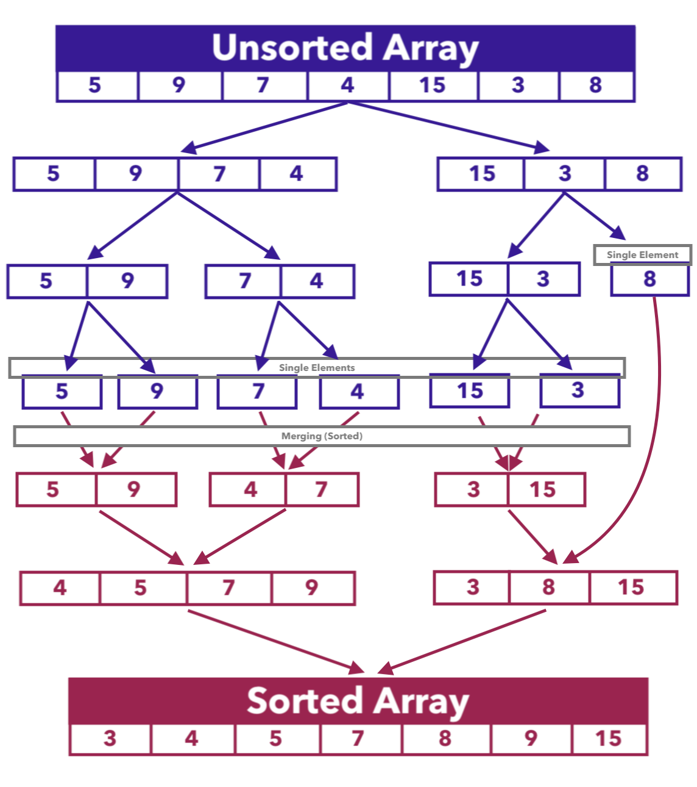

# Sorts - Javascript

## Description

Javascript Sorts explanations, code examples and results. Discussion points on some too.

## Table of Contents

- [Description](#description)
- [Selection Sort](#selection-sort)
- [Bubble Sort](#bubble-sort)
- [Merge Sort](#merge-sort)
- [Quick Sort](#quick-sort)

---

## Selection Sort

- [selection-sort.js](./selection-sort/selection-sort.js)

Selection Sort finds the lowest number in array and if there is a lower number than it then swap it with starting number and then start in next item in array.

The idea behind selection sort is that you loop through the input array linearly, selecting the first smallest element, and then swap it to the first position. Then you loop through the array again using a linear scan and get the second smallest element, swap it to the second position, and so on and so forth until your array is completely sorted.

The swap needs to make use of a temp var to hold when assignment happens.

Has nested for loops so O(n)squared, exponential curve. Not efficient.

Results:

    (git branch): [main] $ node selection-sort/selection-sort.js
    unsorted: 15,12,41,2,20,23,37,6,30,46
    tracking smallest index: 0
    tracking smallest value: 15
    j value: 12
    array[1]: 12 is smaller!
    j value: 41
    j value: 2
    array[3]: 2 is smaller!
    j value: 20
    j value: 23
    j value: 37
    j value: 6
    j value: 30
    j value: 46
    swapped, array[0]: 2
    swapped array[3]: 15
    tracking smallest index: 1
    tracking smallest value: 12
    j value: 41
    j value: 15
    j value: 20
    j value: 23
    j value: 37
    j value: 6
    array[7]: 6 is smaller!
    j value: 30
    j value: 46
    swapped, array[1]: 6
    swapped array[7]: 12
    tracking smallest index: 2
    tracking smallest value: 41
    j value: 15
    array[3]: 15 is smaller!
    j value: 20
    j value: 23
    j value: 37
    j value: 12
    array[7]: 12 is smaller!
    j value: 30
    j value: 46
    swapped, array[2]: 12
    swapped array[7]: 41
    tracking smallest index: 3
    tracking smallest value: 15
    j value: 20
    j value: 23
    j value: 37
    j value: 41
    j value: 30
    j value: 46
    tracking smallest index: 4
    tracking smallest value: 20
    j value: 23
    j value: 37
    j value: 41
    j value: 30
    j value: 46
    tracking smallest index: 5
    tracking smallest value: 23
    j value: 37
    j value: 41
    j value: 30
    j value: 46
    tracking smallest index: 6
    tracking smallest value: 37
    j value: 41
    j value: 30
    array[8]: 30 is smaller!
    j value: 46
    swapped, array[6]: 30
    swapped array[8]: 37
    tracking smallest index: 7
    tracking smallest value: 41
    j value: 37
    array[8]: 37 is smaller!
    j value: 46
    swapped, array[7]: 37
    swapped array[8]: 41
    tracking smallest index: 8
    tracking smallest value: 41
    j value: 46
    tracking smallest index: 9
    tracking smallest value: 46
    POST sorted: 2,6,12,15,20,23,30,37,41,46

---

## Insertion Sort

- [insertion-sort.js](./insertion-sort/insertion-sort.js)

Insertion Sort is similar to the way you sort playing cards in your hands and is a simple sorting algorithm that builds the final sorted array one item at a time.

The iteration starts at the second element. We consider the first element sorted by default.

For each iteration, we keep track of the current element. Each current element will be the first element of the unsorted array - and each element before it will belong to the sorted array.

Through a while loop, we go through the sorted array and shift elements to the right, opening up a space for the current element to be inserted.

Once we find the proper place for it, the current element is inserted into the newly-opened slot. This process is repeated for each iteration until the array is sorted.

It is much less efficient on large lists than more advanced algorithms such as quick sort or merge sort. O(n)squared because of nested for loops.

Steps:

- pull a card out so that is the variable and then
- find the spot to fit it into and
- do it until done

### Results

    (git branch): [main] $ node insertion-sort/insertion-sort.js
    PRE unsorted: 49,25,5,47,20,13,19,21,44,24,17,15,26,44,50
    insertionSort: 25,49,5,47,20,13,19,21,44,24,17,15,26,44,50
    insertionSort: 5,25,49,47,20,13,19,21,44,24,17,15,26,44,50
    insertionSort: 5,25,47,49,20,13,19,21,44,24,17,15,26,44,50
    insertionSort: 5,20,25,47,49,13,19,21,44,24,17,15,26,44,50
    insertionSort: 5,13,20,25,47,49,19,21,44,24,17,15,26,44,50
    insertionSort: 5,13,19,20,25,47,49,21,44,24,17,15,26,44,50
    insertionSort: 5,13,19,20,21,25,47,49,44,24,17,15,26,44,50
    insertionSort: 5,13,19,20,21,25,44,47,49,24,17,15,26,44,50
    insertionSort: 5,13,19,20,21,24,25,44,47,49,17,15,26,44,50
    insertionSort: 5,13,17,19,20,21,24,25,44,47,49,15,26,44,50
    insertionSort: 5,13,15,17,19,20,21,24,25,44,47,49,26,44,50
    insertionSort: 5,13,15,17,19,20,21,24,25,26,44,47,49,44,50
    insertionSort: 5,13,15,17,19,20,21,24,25,26,44,44,47,49,50
    insertionSort: 5,13,15,17,19,20,21,24,25,26,44,44,47,49,50
    Post Sort:  5 13 15 17 19 20 21 24 25 26 44 44 47 49 50

---

## Bubble Sort

- [bubble-sort.js](./bubble-sort/bubble-sort.js)

Bubble Sort is a common, comparison algorithm and is useful to know but it runs in Big O complexity of O(n²) time, making it an inefficient algorithm for larger lists.

Every pair of adjacent values are compared, and then the two values swap positions if the first value is greater than the second. This way during each pass through the array, the largest value “bubbles up” to the top/right-side, and after each pass the elements furthest to the right are in the correct order.

For example: given the following array:

    const unsortedArr = [7,4,1,5,8];

And using bubble sort to sort the array in ascending order results in:

    const sortedArr = [1,4,5,7,8];

It starts by comparing the first pair of values, 7 & 4. 4 is smaller than 7, so it’ll swap the two values and then move on to compare the next pair of values, 7 & 1. It’ll continue doing this over and over until the array is sorted:

Iteration 1: [**7,4**,1,5,8] → [4,**7,1**,5,8] → [4,1,**7,5**,8] → [4,1,5,**7,8**] → [4,1,5,7,8]

Iteration 2: [**4,1**,5,7,8] → [1,**4,5**,7,8] → [1,4,**5,7**,8] → [1,4,5,**7,8**] → [1,4,5,7,8]

Iteration 3: [**1,4**,5,7,8] → [1,**4,5**,7,8] → [1,4,**5,7**,8] → [1,4,5,**7,8**] → [1,4,5,7,8]

Note that after Iteration 2 the array is already sorted. Bubble Sort, however, needs a final pass through the array to ensure that no other swaps are necessary before returning the array, hence Iteration 3.

### Sample Code & Results

Code:

    for (let i = 0; i < 100; i++) {
    unsortedInputArray.push(Math.round(Math.random() \* 100));
    }

Results:

    (git branch): [main] $ node bubble-sort/bubble-sort.js
    unsortedInputArray: 98,70,58,5,70,75,90,27,58,80,89,26,8,84,26,79,7,38,47,50,75,51,49,36,2,66,95,31,54,63,96,57,82,91,94,56,14,36,46,75,77,32,8,4,84,55,50,10,27,18,97,28,24,93,54,65,98,36,45,13,99,33,83,43,13,0,32,27,40,75,71,38,67,35,48,85,44,71,44,49,35,63,96,96,7,21,79,68,59,77,49,95,10,87,70,30,24,27,68,100

Code (1st pass only):

    // Create array that will hold unsorted values
    const unsortedArray = [];

    // seed data in unsortedInputArray
    for (let i = 0; i < 5; i++) {
    unsortedArray.push(Math.round(Math.random() * 5));
    }

    // create bubble sort array function
    const bubbleSort = (array) => {
    console.log("inside bubbleSort array function, array received: " + array);

    //bubble sort compares adjacent values
    //if item that's before is greater than the item that follows it
    //then swap the items
    //in order to swap, must first store item that's before temporarily
    //must do all this in a loop

    //must perhaps wrap loop inside another loop to do entire array several times

    for (let i = 0; i < array.length; i++) {
        if (array[i] > array[i + 1]) {
        console.log(".. pair to compare .. ");
        console.log("array: " + array);
        console.log("array[" + i + "]: " + array[i]);
        console.log("array[" + (i + 1) + "]: " + array[i + 1]);
        const tempBefore = array[i];
        console.log("tempBefore: " + array[i]);
        array[i] = array[i + 1];
        console.log(".. compared pair ..");
        console.log("array[" + i + "]: " + array[i]);
        array[i + 1] = tempBefore;
        console.log("array[" + (i + 1) + "]: " + array[i + 1]);
        }
    }

    //return array when swapping done
    return array;
    };

    // const sorted = bubbleSort(unsortedArray);
    //good example to show how just for loop is not enough
    //join() returns an array as a string.
    //join() does not change the original array.

    const myArray = [3, 2, 1];
    console.log("Pre Sort Array:", myArray.join(" "));
    const sorted = bubbleSort(myArray);
    console.log("Post Sort Array:", sorted.join(" "));
    console.log("DONE!");

    console.log("unsortedArray values: " + unsortedArray);

    console.log("Pre Sort Array:", unsortedArray.join(" "));
    const sortedArr = bubbleSort(unsortedArray);
    console.log("Post Sort Array:", sortedArr.join(" "));
    console.log("DONE!");

Results (1st pass only):

    (git branch): [main] $ node bubble-sort/bubble-sort.js
    Pre Sort Array: 3 2 1
    inside bubbleSort array function, array received: 3,2,1
    .. pair to compare ..
    array: 3,2,1
    array[0]: 3
    array[1]: 2
    tempBefore: 3
    .. compared pair ..
    array[0]: 2
    array[1]: 3
    .. pair to compare ..
    array: 2,3,1
    array[1]: 3
    array[2]: 1
    tempBefore: 3
    .. compared pair ..
    array[1]: 1
    array[2]: 3
    Post Sort Array: 2 1 3
    DONE!
    unsortedArray values: 3,1,1,2,2
    Pre Sort Array: 3 1 1 2 2
    inside bubbleSort array function, array received: 3,1,1,2,2
    .. pair to compare ..
    array: 3,1,1,2,2
    array[0]: 3
    array[1]: 1
    tempBefore: 3
    .. compared pair ..
    array[0]: 1
    array[1]: 3
    .. pair to compare ..
    array: 1,3,1,2,2
    array[1]: 3
    array[2]: 1
    tempBefore: 3
    .. compared pair ..
    array[1]: 1
    array[2]: 3
    .. pair to compare ..
    array: 1,1,3,2,2
    array[2]: 3
    array[3]: 2
    tempBefore: 3
    .. compared pair ..
    array[2]: 2
    array[3]: 3
    .. pair to compare ..
    array: 1,1,2,3,2
    array[3]: 3
    array[4]: 2
    tempBefore: 3
    .. compared pair ..
    array[3]: 2
    array[4]: 3
    Post Sort Array: 1 1 2 2 3
    DONE!

Code (however many passes are needed):

    // Create array that will hold unsorted values
    const unsortedArray = [];

    // seed data in unsortedInputArray
    for (let i = 0; i < 5; i++) {
    unsortedArray.push(Math.round(Math.random() * 5));
    }

    // create bubble sort array function
    const bubbleSort = (array) => {
    console.log("inside bubbleSort array function, array received: " + array);

    //bubble sort compares adjacent values
    //if item that's before is greater than the item that follows it
    //then swap the items
    //in order to swap, must first store item that's before temporarily
    //must do all this in a loop

    //must perhaps wrap loop inside another loop to do entire array several times

    for (let i = 0; i < array.length; i++) {
        for (let j = 0; j < array.length; j++) {
        if (array[j] > array[j + 1]) {
            console.log(".. pair to compare .. ");
            console.log("array: " + array);
            console.log("array[" + j + "]: " + array[j]);
            console.log("array[" + (j + 1) + "]: " + array[j + 1]);
            const tempBefore = array[j];
            console.log("tempBefore: " + array[j]);
            array[j] = array[j + 1];
            console.log(".. compared pair ..");
            console.log("array[" + j + "]: " + array[j]);
            array[j + 1] = tempBefore;
            console.log("array[" + (j + 1) + "]: " + array[j + 1]);
        }
        }
    }

    //return array when swapping done
    return array;
    };

    // const sorted = bubbleSort(unsortedArray);
    //good example to show how just for loop is not enough
    //join() returns an array as a string.
    //join() does not change the original array.

    const myArray = [3, 2, 1];
    console.log("Pre Sort Array:", myArray.join(" "));
    const sorted = bubbleSort(myArray);
    console.log("Post Sort Array:", sorted.join(" "));
    console.log("DONE!");

    console.log("unsortedArray values: " + unsortedArray);

    console.log("Pre Sort Array:", unsortedArray.join(" "));
    const sortedArr = bubbleSort(unsortedArray);
    console.log("Post Sort Array:", sortedArr.join(" "));
    console.log("DONE!");

Results (however many passes are needed):

    (git branch): [main] $ node bubble-sort/bubble-sort.js git add -A
    Pre Sort Array: 3 2 1
    inside bubbleSort array function, array received: 3,2,1
    .. pair to compare ..
    array: 3,2,1
    array[0]: 3
    array[1]: 2
    tempBefore: 3
    .. compared pair ..
    array[0]: 2
    array[1]: 3
    .. pair to compare ..
    array: 2,3,1
    array[1]: 3
    array[2]: 1
    tempBefore: 3
    .. compared pair ..
    array[1]: 1
    array[2]: 3
    .. pair to compare ..
    array: 2,1,3
    array[0]: 2
    array[1]: 1
    tempBefore: 2
    .. compared pair ..
    array[0]: 1
    array[1]: 2
    Post Sort Array: 1 2 3
    DONE!
    unsortedArray values: 0,2,5,2,2
    Pre Sort Array: 0 2 5 2 2
    inside bubbleSort array function, array received: 0,2,5,2,2
    .. pair to compare ..
    array: 0,2,5,2,2
    array[2]: 5
    array[3]: 2
    tempBefore: 5
    .. compared pair ..
    array[2]: 2
    array[3]: 5
    .. pair to compare ..
    array: 0,2,2,5,2
    array[3]: 5
    array[4]: 2
    tempBefore: 5
    .. compared pair ..
    array[3]: 2
    array[4]: 5
    Post Sort Array: 0 2 2 2 5
    DONE!

### Discussion Points

- **Point 1**: Can you think of a way to solve this problem with force?

- **Good Answer**: The forced solution is to take a look through the array one index at a time and loop through the rest of the array to compare and swap values when needed.

- **Note**: This is very slow for large input arrays, so it's not the _best_ answer, but it's a good start. This will involve using two loops to check the array at a specific index and compare it to the rest of the values after it in the array, even if it's sorted already.

---

- **Point 2**: How would we know if a value in the array needs to be swapped and sorted?

- **Good Answer**: We can identify an unsorted element by checking if it's less than or greater than an element later in the array.

- **Note**: We can assume that any value to the left of the current index in the array is already sorted, so we just need to concern ourselves with the values to the right of the current index.

---

- **Point 3**: What happens when we identify a value that should be swapped with another?

- **Good Answer**: We swap the values by storing one value in a temporary variable and overwriting them at their identified indices in the array.

- **Note**: Some developers will make a specific function to handle swapping values in an array, but it's also okay to do it within the bubble sort algorithm itself. Swapping a value will necessitate a temporary variable to hold one value before it is overwritten by the value it's being swapped with.

---

- **Point 4**: If we don't want to use the force method and implement one that's a bit more efficient, how can we know if the array is sorted early?

- **Good Answer**: We can use a `while` loop and implement a flag that checks if any values haven't been swapped, indicating that the array is now sorted.

- **Note**: The use of a `while` loop can allow us to avoid unnecessary iterations of the function and escape early if it detects the array is sorted. The way to do this is to set a flag at the beginning of the iteration and change its value only if it finds a value that needs to be swapped.

---

## Merge Sort

- [merge-sort.js](./merge-sort/merge-sort.js)

Merge Sort uses the concept of divide-and-conquer to sort the given list of elements.

Its algorithm requires a bit of knowledge in recursion and both time and space complexity for an algorithm.

The algorithm works by **breaking the input array in half over and over again until the array's values are all in their own array. They are then compared to one another and merged back together in order.**

This allows for it to break down the problem, the array, into smaller subproblems until they become simple enough to solve directly.

Here are the steps Merge Sort takes:

1. Split the given list into two halves (roughly equal halves in case of a list with an odd number of elements).
2. Continue dividing the subarrays in the same manner until you are left with only single element arrays.
3. Then starting with the single element arrays, **Merge** the subarrays so that each merged subarray is sorted.
4. Repeat step 3 until it ends up with a single sorted array.

For example:

[5, 9, 7, 4, 15, 3, 8]:

[Walk-thru on VisualGo.net .. make sure to select "MER" item in the top nav (as there are other sorts available) & then click "GO"](https://visualgo.net/en/sorting?slide=1)

### Discussion Points

- **Point 1**: How would we get the middle point of an array? Can we simply split the array's length in half?

- **Good Answer**: We can simply split the array's length in half and use that as the index, but we'll want to floor the value first just in case there is an odd number of elements in the array.

- **Note**: Unlike a quick sort algorithm, we are more concerned about breaking our array in half as many times as possible and then sorting it after. To get the middle value, however, we'll want to make sure it's a whole number because it needs to represent an index in the array.

---

- **Point 2**: When merging two arrays together, do we need to loop through every index of each array?

- **Good Answer**: No, we will loop through both arrays until there isn't a next index to check in one of them. We'll get through one array, but the other one will have leftover values that will be concatenated onto the output array.

- **Note**: There is no guarantee that both arrays will be the same length, which is fine. The point of this merge functionality is to compare two arrays and create a new array out of it with all of the values merged in order.

---

- **Point 3**: How will the function know when to stop splitting the input array into smaller arrays for comparison and sorting?

- **Good Answer**: It will know to stop splitting the input array and return it as-is when there is only one element left in the array.

- **Note**: We need to check if the array only has one element left or less before attempting to split it again. The `mergeSort()` function will stop recursively calling itself once every single element in the input array has been split.

---

- **Point 4**: What would be a good reason to use a merge sort algorithm compared to other sorting algorithms? What would be a reason NOT to use one?

- **Good Answer**: A good reason to use a merge sort algorithm is that its Big O complexity in a worst-case scenario is still `O(n log(n))`, whereas some other algorithms may see a Big O complexity of `O(n^2)`, making them slower. A reason to not use this algorithm is that it takes up more space in memory because it is creating and storing numerous arrays.

- **Note**: If the machine running this algorithm is powerful enough, having a larger space complexity will be okay if it means a more stable time complexity of `O(n log(n))`. Other sorting algorithms take up less memory during execution but may take longer to complete.

---

## Quick Sort

- [quick-sort.js](./quick-sort/quick-sort.js)

Quick Sort randomly selects a value in the array to serve as the "pivot" value. This value will then be used to sort the rest of the array's elements by pushing them into new arrays to hold elements lesser than or equal the pivot value (to the left) and elements greater than the pivot value (to the right). We then run those left and right arrays through the same sorting functionality over and over again until the left and right arrays are sorted and then concatenate them together and return the full sorted array.

Eventually as we chop arrays up, we get to a place where there is just 1 item in array. O(log n).

---

© 2021 All Rights Reserved.
